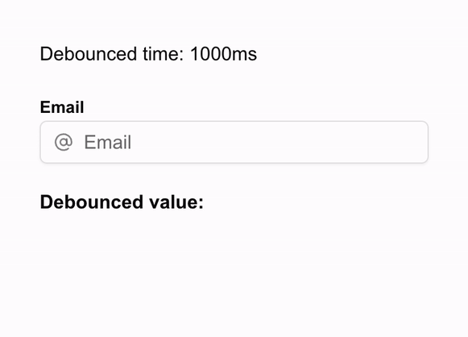
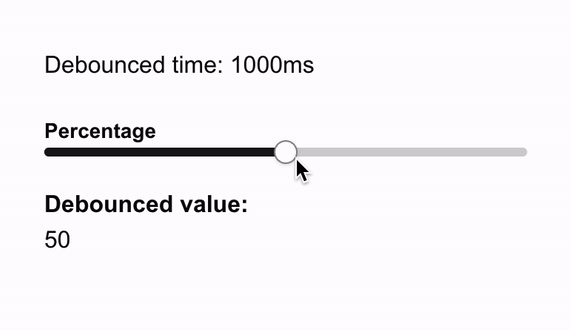
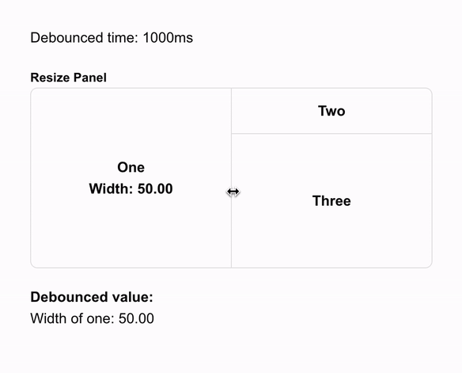

# DebounceControl

> React component that debounce state. Can be used with [any form element](#demo).

## ✨ Features

- Minimal re-renders
- Works with any form element
- No dependencies
- TypeScript support
- Custom delay

## 🚀 Install

```bash
npm install debounce-control
```

## 🧑‍💻 Usage

```tsx
import React, { useState } from "react";
import DebounceControl from "debounce-control";

const App = () => {
  const [text, setText] = useState("");

  const onChange = (value: string) => {
    setText(value);
  };

  return (
    <DebounceControl
      value={text}
      delay={300}
      onDebouncedChange={onChange}
      render={({ value, onChange }) => (
        <input
          type='text'
          value={value}
          onChange={(e) => onChange(e.target.value)}
        />
      )}
    />
  );
};

export default App;
```

## 📺 Demo

### Input



### Slider



### Resizable



## 📎 Props

| Props             | Default | Description                                       |
| ----------------- | ------- | ------------------------------------------------- |
| value             |         | Original state value                              |
| delay             | 500     | Delay in milliseconds                             |
| onDebouncedChange |         | Callback function that will be called after delay |
| render            |         | Render function to use your form component        |
